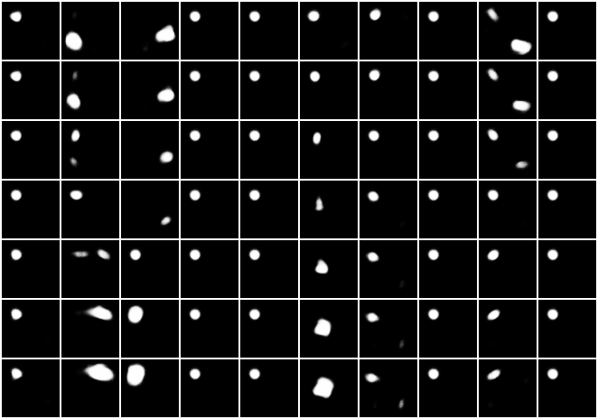

The PyTorch version doesn't seem to work, as it gives entangled reconsturctions. Moreover, the KL values and loss it gives compared to Tensorflow's versions are fundamentally different. Needs investigation.

