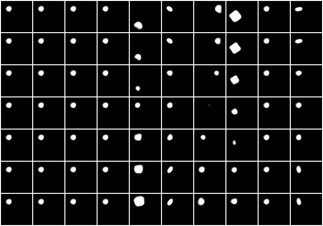

The PyTorch version seems to work worse than Tensorflow's implementation, as it gives entangled reconsturctions. Moreover, the KL values and loss it gives compared to Tensorflow's versions are fundamentally different. Needs investigation.

