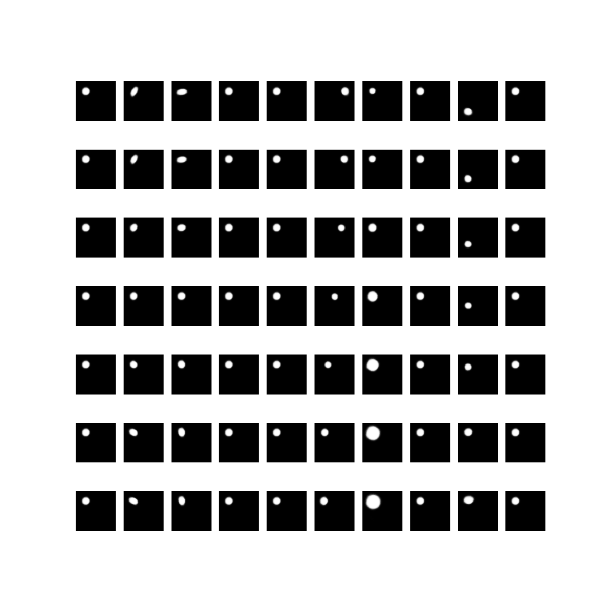

Latent traversals after training for 40 epochs. The traversals are constructed by obtaining the posterior of the first datapoint in the dSprites dataset, and then setting the invidual latents to values ranging from -3 to 3. Each column represents the traversal of one latent. 

